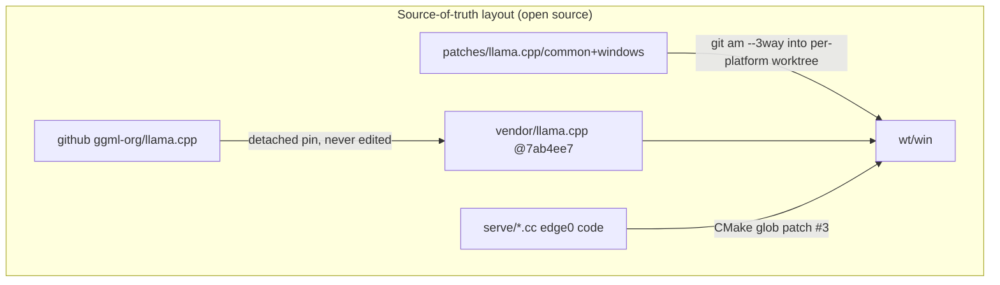

# edge0-windows — Release Build Guide

English | [中文](README_zh.md) | [日本語](README_ja.md) | [Español](README_es.md) | [Français](README_fr.md)

This document is for **developers building or evaluating the Windows app from source**. It covers: quick start (build → run → test), measured performance on the reference machine, and the technical choices behind the stack.

edge0 is published as a **monorepo** — [`Edge0-AI/edge0`](https://github.com/Edge0-AI/edge0) — whose top level holds the shared engine supply (`vendor.llama.pin` + the scripts-materialized `vendor/llama.cpp`, `patches/llama.cpp/` band-sets) and the platform subprojects (`windows/` = this app, `android/` = the companion). Inference runs on pinned upstream llama.cpp, patched as a replayable patch set, with dense compute on HIP (ROCm) or Vulkan and MoE expert weights served from CPU (local GGUF files get a per-GPU offload plan, §1.4).

Third-party attribution: see `NOTICE` in this directory. Model cards: [Edge0/Edge0-8B-A1B-preview](https://huggingface.co/Edge0/Edge0-8B-A1B-preview) · [Edge0/Edge0-35B-A3B-preview](https://huggingface.co/Edge0/Edge0-35B-A3B-preview).

---

## 1. Quick Start

### 1.1 Prerequisites

| toolchain | requirement |
|---|---|
| OS | Windows 10 / 11 x64 |
| Visual Studio 2022 | C++ workload (MSVC) |
| CMake | ≥ 3.21 |
| AMD HIP SDK for Windows (ROCm) | **default GPU backend** (`-Backend hip`) for RDNA2 (gfx1030/1031/1032) and RDNA4 (gfx1200/1201). Version 6.1 or newer; the installer sets `HIP_PATH` |
| Ninja | build tool for the HIP configure (`winget install Ninja-build.Ninja`) |
| Vulkan SDK | fallback GPU backend (`-Backend vulkan`) for any AMD/NVIDIA/Intel dGPU; iGPU works but slower |
| Rust | stable, with `cargo` (Tauri 2 shell) |
| Node.js | LTS (`npm`) |
| Python | 3.10+ with `numpy` (on-device converter + benches) |
| Disk / RAM | ≥ 30 GB free disk; RAM: 8 GB+ runs 8B, 16 GB+ runs 35B (paging-bound), the reference machine is 48 GB |

### 1.2 Build the engine (llama.cpp + patches + edge0 serving code)

```powershell
git clone https://github.com/Edge0-AI/edge0
cd edge0/windows
pwsh -File scripts/vendor-build.ps1                     # HIP (ROCm) for RDNA2 + RDNA4; first build ≈ 10–20 min
pwsh -File scripts/vendor-build.ps1 -Backend vulkan     # Vulkan fallback (any GPU vendor)
pwsh -File scripts/vendor-build.ps1 -GpuTargets "gfx1030;gfx1031;gfx1200;gfx1201"   # add RDNA2 SKUs
```

The script resolves the engine depot in two ways, then materializes the supply:

- **monorepo clone (normal path)** → the parent directory carries `vendor.llama.pin` + `patches/llama.cpp/{common,windows}`; the script replays the 8 patches (`git am --3way`) into an isolated build worktree at `../wt/win` (gitignored build area) — the vendor tree itself is **never patched in place**;
- `EDGE0_DEPOT` env → point at an existing depot elsewhere.

The llama.cpp tree is **not** a submodule: on first run the script clones upstream (shallow of blobs) into `../vendor/llama.cpp` and detaches the commit pinned in `vendor.llama.pin`; afterwards that directory is just a gitignored checkout you can refresh with `git fetch`. Set `EDGE0_LLAMA_URL` to clone from a mirror.

`-AssembleOnly` runs everything except compilation (seconds; verifies the patch replay still applies and hashes match). Output:

```
wt\win\build-hip\bin\llama-server.exe          (-Backend hip: + ggml*.dll, HIP runtime DLLs, rocblas\library, hipblaslt\library\<arch>)
wt\win\build-vk\bin\Release\llama-server.exe   (-Backend vulkan: + llama.dll, ggml*.dll)
```

#### Backend notes

- **HIP (ROCm), default.** Targets: RDNA2 `gfx1030` (RX 6800 / 6900 family; the `gfx1031` and `gfx1032` SKUs need `-GpuTargets` with their own targets) and RDNA4 `gfx1200` / `gfx1201` (RX 9060 and RX 9070 family). The default `-GpuTargets` is `gfx1030;gfx1200;gfx1201`; each extra target adds compile time.
- The script uses the HIP SDK's own `clang` / `clang++` (found under `%HIP_PATH%\lib\llvm\bin` or `%HIP_PATH%\bin`) and Ninja. It copies the HIP runtime DLLs and the rocBLAS kernel data for the requested targets next to `llama-server.exe`. That copy matters: the driver's `amdhip64` DLL in `System32` is searched before `PATH`.
- The app uses HIP when the `build-hip` depot build exists. Force a backend with `EDGE0_BACKEND=hip` or `EDGE0_BACKEND=vulkan`. The Service page doctor reports the backend and the GPU the engine itself lists.
- **Status:** the HIP build follows upstream's Windows HIP instructions and CI matrix. It is **verified on RDNA4 (`gfx1201`, RX 9070 XT)** — see §2.1; RDNA2 (`gfx1030`) is still unverified. The §2 Vulkan table predates the HIP measurements; §2.1 has the HIP numbers.
- **Runtime staging:** the script copies both `rocblas\library` and `hipblaslt\library\<arch>` next to `llama-server.exe`. Both are required: hipBLAS dispatches RDNA2 to rocBLAS and RDNA3/4 to hipBLASLt, and a missing hipBLASLt library dir makes the dense f16 GEMM fall back to ~8 TF (vs ~96 TF) on RDNA4.

### 1.3 Build the app (Tauri installer + portable exe)

```powershell
cd app
npm install
npx tauri build
```

Artifacts:

```
app\src-tauri\target\release\edge0-app.exe                              ← portable, no install
app\src-tauri\target\release\bundle\nsis\edge0_0.1.0_x64-setup.exe      ← NSIS installer
```

The shell locates the engine via `EDGE0_BIN_DIR` (default: the depot engine build dir above — see `app/README.md` env table for the full override surface). Set it if your engine build lives elsewhere.

### 1.4 Models

Nothing to pre-install: the app downloads from HuggingFace on first use, then converts on-device (one-time, ~2–6 min for 8B). Per-file `sha256` is verified against a published manifest and resumable via HTTP Range.

Manual seed (offline machines): place the MLX repo files under

```
~\.edge0\models\edge0-8b\        (chat_template.jinja, model*.safetensors, lora_edge0_8b.safetensors, tokenizer…)
~\.edge0\models\edge0-35b\       (…sharded safetensors, lora_edge0_35b.safetensors…)
```

The converter output is `models\edge0-<tier>-gguf\edge0-<tier>.gguf` + LoRA adapter; conversion is idempotent (sha-gated). Home dir is `EDGE0_HOME` (default `~\.edge0`).

#### Local GGUF models (MoE families)

Any GGUF from a supported MoE family runs on the same engine as the Edge0 tiers. In **Models → Local GGUF models**, scan a folder (default `~\.edge0\models\local-gguf`) or paste the path of a `.gguf` file (for a split model, the first shard). The shell reads the header with `tools\gguf_tool.py` (standard-library Python, read-only), asks the engine which GPU it sees (`llama-server --list-devices`, no model loaded), and plans the expert offload for that budget:

- every expert fits on the GPU → `-ngl 99`;
- otherwise the smallest `--n-cpu-moe N` that fits (experts of the first N layers stay in system RAM); if even that does not fit, `--cpu-moe`;
- the KV cache for the chosen context and 1.5 GiB of headroom come off the GPU budget first.

**Load** stays disabled unless the plan says the model fits. The engine then starts with the planned flags plus `--ctx-size`, `--flash-attn auto` and `--no-webui`. Local GGUF loads do not use the LoRA adapter or `--pool-mb`, which are Edge0-tier features.

#### Disk expert streaming (any model, including small ones)

Experts are streamed with **explicit whole-block reads**, not mmap demand-paging. `--pool-mb` (`E0_POOL_MB`) fills committed private pages for routed experts via `ReadFile` on the GGUF handle; the expert-base resolver (patch surface #7) redirects expert reads to the pool arena, so expert bytes never take the mmap fault path. This is deliberate: a per-expert fault storm (hundreds of 4K faults) is roughly an order of magnitude slower on consumer SSDs than one sequential whole-block read, and mmap's OS-LRU evicts and re-faults experts the router needs again — the reload churn. Peak VRAM/RAM stays bounded by the *active* expert set instead of the parameter count, so this applies to **any** model, including one that would otherwise fit entirely on the GPU (keep experts off the GPU with `--n-cpu-moe`). The pool currently sizes F32/F16/BF16/Q4_1 experts; the K-quants / MXFP4 / NVFP4 experts most GGUFs use need the type-size generalization (in progress). With no prerouter sidecar the pool is demand-fill only (routed experts, no prediction); the `[pref-trace]` lines in the engine log report pool hits, fills, and bytes.

Families are tied to the pinned engine (`tools/moe_families.json`). `gguf_tool.py registry-check` checks each arch against `src/llama-arch.cpp` at the pin, and CI runs that check.

| family | GGUF architecture | example repos (Hugging Face) |
|---|---|---|
| Qwen3 MoE | `qwen3moe` | `unsloth/Qwen3-30B-A3B-GGUF` |
| Qwen3.5 / 3.6 MoE | `qwen35moe` | — |
| Qwen3-Next | `qwen3next` | — |
| Qwen3-VL MoE (text path only) | `qwen3vlmoe` | — |
| Qwen2 MoE | `qwen2moe` | — |
| gpt-oss | `gpt-oss` | `ggml-org/gpt-oss-20b-GGUF`, `ggml-org/gpt-oss-120b-GGUF` |
| Poolside Laguna | `laguna` | `Lucebox/Laguna-XS.2-GGUF` |
| GLM-4.5 / 4.6 / 4.7 | `glm4moe` | `unsloth/GLM-4.5-Air-GGUF`, `unsloth/GLM-4.6-GGUF` |
| GLM-5 | `glm-dsa` | — |
| DeepSeek V2 / V3 / R1, Kimi K2 | `deepseek2` | — |
| DeepSeek V3.2 | `deepseek32` | — |
| Mixtral (`llama` arch with experts) | `llama` | — |
| Llama 4 | `llama4` | — |
| MiniMax M2 | `minimax-m2` | — |
| ERNIE 4.5 MoE | `ernie4_5-moe` | — |
| Hunyuan MoE | `hunyuan-moe` | — |
| OLMoE | `olmoe` | — |
| Granite MoE | `granitemoe` | — |
| Ling / Bailing MoE | `bailingmoe`, `bailingmoe2`, `bailingmoe3` | — |
| dots.llm1 | `dots1` | — |
| Phi-3.5-MoE | `phimoe` | — |
| LFM2 MoE | `lfm2moe` | — |
| Nemotron-H MoE | `nemotron_h_moe` | — |
| Step 3.5 | `step35` | — |
| Mistral 4 | `mistral4` | — |
| EXAONE MoE | `exaone-moe` | — |
| Xiaomi MiMo | `mimo2` | — |
| Kimi Linear / Kimi K3 | `kimi-linear`, `kimi-k3` | — |

Not covered: architectures the pinned engine does not register. Adding one means a pin bump or new engine code, which is a separate change. Vision input (the mmproj projector) is not wired, so Qwen3-VL runs text only. Tool calls and reasoning follow each model's embedded chat template; `--jinja` is on by default at this pin. The KV estimate is an upper bound, and the plan notes which formula it used.

### 1.5 Run the app

Launch `edge0-app.exe` (or install the NSIS package). Typical flow:

1. **Models page** — pick 8B (fast, ~5 GB) or 35B (~21 GB); *Download* → auto *Convert* → *Load*.
2. **Chat page** — streamed Markdown answers; the engine runs as a supervised child process and is killed with the app (Windows Job Object, `KILL_ON_JOB_CLOSE`).
3. **Doctor** (bottom of Models page) — one-click health check: engine binary, model files, disk, env.
4. Troubleshooting: engine/convert logs land in `~\.edge0\logs\`.

Engine API (the app uses it internally, you can point any OpenAI-compatible client at it): `http://127.0.0.1:<port>/v1/chat/completions`, loopback-only. Load params (process contract): `-ngl 99 -cmoe --ctx-size 8192 --flash-attn on --pool-mb <tier×RAM clamp> --mem-budget-mb …`. Local GGUF loads use the planned flags instead of `-cmoe` and `--pool-mb` (§1.4).

### 1.6 Test it

```powershell
cd app\src-tauri
cargo test                                   # fast suite: resume/probe logic against a local fake server
python -m pytest tools\tests -q              # GGUF helper + MoE family registry (standard library only)

# end-to-end, real model (downloads 4.5 GB if not seeded):
cargo test --test real8b -- --ignored --nocapture

# throughput reproduction (expects the table in §2, ±day-to-day drift):
python ..\..\tools\r3_bench.py --tier 8b
python ..\..\tools\r3_bench.py --tier 35b
```

`r3_bench.py` resolves paths with the same contract as the app: the engine from the depot build dir
(`EDGE0_BIN_DIR` override honored), the converted GGUF from the app's model home (`EDGE0_HOME`,
default `~\.edge0\models`) or a repo-local `models/` when present; results land in `benchmarks/r3/`.

```powershell
# patch-replay gate (no compile, seconds):
pwsh ..\..\scripts\vendor-build.ps1 -AssembleOnly
```

---

## 2. Performance

Reference machine: **Intel i7-14700K · AMD Radeon RX 9070 GRE (Vulkan) · 48 GB DDR5 · Windows 11**, steady-state (`-ngl 99 -cmoe`), bench medians of 3 reps (`tools/r3_bench.py`, ~240-token mixed-language prompt, native context). These numbers come from the Vulkan build; the HIP build has not been measured yet.

| model | prefill (tok/s) | decode (tok/s) | prefill of 240-tok prompt |
|---|---:|---:|---:|
| edge0-8B-A1B | ~212 | ~44.8 | ~1.1 s |
| edge0-35B-A3B | ~70 | ~27.7 | ~3.7 s |

Context to keep when reading these numbers:

- Decode is the *token-generation* rate after the prompt is processed; the A1B / A3B active-parameter counts explain why a 35B model decodes at 27+ tok/s.
- Short prompts are much faster than the 240-token column above: the app's first live request on 8B showed **~0.28 s to first token** for a 17-token prompt (engine log). The app runs with `--ctx-size 8192`; benches above use native context (131k / 262k).
- These are warm-RAM measurements on the 48 GB reference machine (a test bed, not a product assumption). On the 16 GB / 8 GB product tiers, experts are served by mmap page-faults and decode drops with memory pressure; a process-level memory cap (`--mem-budget-mb`) is applied automatically from physical RAM to keep the OS working set sane (it measurably *helps* under pressure).
- Same-condition A/B against unpatched vanilla llama.cpp (vendor tree with the patch bands skipped) shows the patch set costs nothing (8B: 41.5 vs 39.5 decode; 35B: 27.2 vs 27.4 — within machine drift).
- Expect day-to-day drift of a few percent on this class of machine; compare like-for-like, same day, same process if you benchmark.

### 2.1 HIP (ROCm) on RDNA4 — measured

Reference: **AMD Radeon RX 9070 XT (`gfx1201`) · 16 GiB VRAM · ReBAR on · 96 GiB RAM · Windows 11**, HIP build, `llama-bench -p 512,2048 -n 128 -ngl 99 -fa auto`.

Qwen3.5-35B-A3B (MXFP4 experts + Q6_K dense), `--n-cpu-moe` sweep:

| n_cpu_moe | pp512 | pp2048 | tg128 |
|---:|---:|---:|---:|
| 0 | 760 | 763 | 33.8 |
| 8 | 430 | 453 | **44.1** |
| 16 | 481 | 536 | 40.7 |
| 24 | 340 | 384 | 30.4 |
| 31 | 267 | 305 | 25.8 |
| 40 | 219 | 247 | 21.9 |

Prefill scales with GPU-resident experts (pp2048 247 → 763, ~3.1×); decode peaks at `--n-cpu-moe 8` (44 tok/s) and drops at 0 (weights spill to RAM over PCIe). Recommended per-profile plans (`gguf_tool.py`, 32k ctx):

| profile | n_cpu_moe | gpu est | cpu est | pp512 | tg128 |
|---|---:|---:|---:|---:|---:|
| 16 GiB VRAM / 32 GiB RAM | 16 | 7.9 GiB | 10.4 GiB | 481 | 40.7 |
| 12 GiB VRAM / 32 GiB RAM | 25 | 7.9 GiB | 10.4 GiB | 344 | 29.9 |
| 8 GiB VRAM / 32 GiB RAM | 35 | 3.7 GiB | 14.7 GiB | 252 | 23.0 |

Dense GEMM (`test-backend-ops`, m4096 n512 k14336): ggml's quantized paths already sit near the card's ~96 TF fp16 peak — MXFP4 86, Q8_0 80, Q4_K 75 TF — while f16 reaches 96 TF only with the hipBLASLt library data staged (§1.2). Decode is bandwidth-bound and unchanged by the f16 path.

---

## 3. Technical Details

### 3.1 Architecture

```mermaid
flowchart LR
  subgraph ondevice ["On-device, first run"]
    A[MLX safetensors<br/>int4 g64] -->|repack, bit-exact<br/>no requant| B[GGUF Q4_1<br/>edge0-tier.gguf]
    A2[MLX LoRA] -->|fuse + adapt| B2[GGUF adapter]
  end
  B --> C[("pinned llama.cpp fork<br/>7ab4ee7 + 8 patches")]
  B2 --> C
  C -->|HIP (ROCm) or Vulkan: dense attn / GDN / norms| D[(GPU)]
  C -->|"-cmoe: expert weights"| E[(CPU, mmap +<br/>L1 advisory pool)]
  C --> F[llama-server<br/>127.0.0.1 OpenAI API]
  F --> G[Tauri 2 shell<br/>supervisor + chat UI]
```



### 3.2 Repo map
```
serve/                 edge0 C++ pieces compiled into libllama (advisory prefetch router, memory budget)
tools/                 MLX→GGUF converter chain (repack + LoRA adapter + catalog) and the throughput bench
app/                   Tauri 2 shell (src-tauri/ Rust, src/ React) — see app/README.md
scripts/               vendor-build.ps1 — engine assembly: patch replay into an isolated worktree
```

The engine changes live at the monorepo root, not in a fork: `vendor/llama.cpp` is the pinned
pristine upstream checkout (never patched in place) and `patches/llama.cpp/` carries the 8
hook-point patches + band README (`common/`, `windows/` here; `android/` for the companion app).
`windows/` deliberately ships **no** nested `patches/` copy — one source of truth, no drift.

### 3.3 Known gaps (as of this release)

- Installer is **unsigned** (SmartScreen warning on first run); no auto-updater yet.
- Engine is not yet bundled inside the installer — portable builds assume the engine build dir; bundling is on the roadmap.
- The `--pool-mb` L1 pool is env-dormant on Windows pending the final memory-tier A/B; the app clamps `--mem-budget-mb` regardless.
- HIP (ROCm) backend: **verified on RDNA4 (`gfx1201`, RX 9070 XT)** — see §2.1. RDNA2 (`gfx1030`) is still unverified. On a machine where HIP fails, use `-Backend vulkan`.
- Dense f16/bf16 GEMM on RDNA3/4 needs `hipblaslt\library\<arch>` staged next to the engine (the build script does this); without it the path falls back to ~8 TF instead of ~96 TF. This does not affect the shipped Edge0 tiers or quantized (MXFP4/Q4_K/Q8_0) models, whose GEMM paths are already near peak.
- Local GGUF MoE loading is verified against synthetic GGUF files and the pinned engine's architecture table. A real download and a GPU load of each family are still to do.
- 35B on ≤16 GB machines is functional but paging-bound; documented floor is 8 GB *working with* the memory cap, at reduced tok/s.

---

*Issues and bench results against other hardware welcome — attach `~\.edge0\logs\engine-*.log` and the `doctor` page screenshot.*
